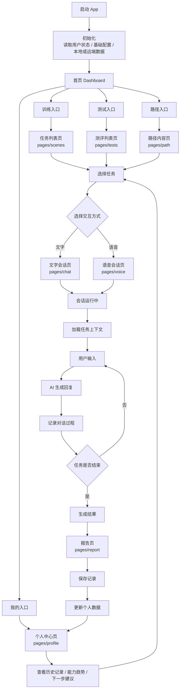
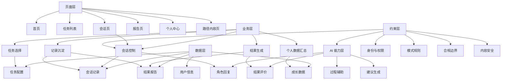

# App 逻辑主干流程图

> 本图先不展开疾病、情景、评分、提示等产品特性，只梳理 App 从进入到完成一次训练/测试，再到结果沉淀的核心逻辑。

## 逻辑分层

## 主干说明

- 首页负责分发入口，不承载复杂业务。
- 训练和测试在任务选择后进入同一套会话主流程，只是模式规则不同。
- 文字会话和语音会话是交互方式差异，底层都进入“会话运行中”。
- 报告页是一次任务的收口，生成结果后再保存记录。
- 个人中心只消费沉淀后的记录和统计，不直接参与会话。
- 路径内容页是内容入口，可引导用户进入对应任务，但不应成为主流程的必经节点。
- App 的核心闭环是：选择任务 → 完成会话 → 生成报告 → 保存记录 → 更新个人数据 → 推荐下一次任务。
